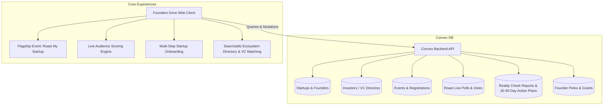

# Founders Drive & Roast My Startup — Implementation Plan with Convex DB Backend

## System Architecture

---

## 1. Convex Backend Schema & Functions (`/convex`)

### Tables in `convex/schema.ts`:
- **`startups`**:
  - `name`, `slug`, `pitch`, `description`, `website`, `city`, `sector`, `stage`, `teamSize`, `traction`, `metrics` (MRR, ARR, GMV, Pilots), `fundingRaised`, `fundStatus` (*Not raising / Raising now / Open to intros*), `targetAmount`, `helpWanted` (Array: *Customer intros, VC intros, GTM mentoring, Grants, etc.*), `momentumScore`, `realityScore`, `featured`, `logoUrl`, `createdAt`
- **`founders`**:
  - `startupId`, `name`, `role`, `email`, `linkedin`, `phone`, `bio`, `isPrimary` (private contact fields protected by controlled intro workflow)
- **`investors`**:
  - `name`, `fundName`, `role`, `stagePreferences` (Pre-Seed, Seed, Series A), `sectors`, `ticketMin`, `ticketMax`, `geography`, `thesis`, `leadPreference`, `portfolioHighlights`, `avatarUrl`, `isVerified`
- **`events`**:
  - `title`, `volume` (*Vol. 01, Vol. 02, etc.*), `date`, `doorsTime`, `startTime`, `venue`, `totalSeats`, `registeredCount`, `status` (*Upcoming / Live / Completed*), `pitchingStartups` (Array of startup IDs)
- **`eventRegistrations`**:
  - `eventId`, `fullName`, `email`, `roleType` (*Founder, Investor, Operator, Audience, Media*), `companyName`, `registeredAt`
- **`pitchApplications`**:
  - `eventId`, `startupId`, `founderName`, `email`, `pitchDeckUrl`, `videoUrl`, `whyScrutinyReady`, `status` (*Pending, Shortlisted, Selected, Waitlisted*)
- **`roastPolls`**:
  - `eventId`, `pitchNumber` (1 to 4), `startupId`, `startupName`, `tagline`, `status` (*Active, Closed*)
- **`pollVotes`**:
  - `pollId`, `voterSessionId`, `clarityScore` (1-10), `investibilityScore` (1-10), `innovationScore` (1-10), `tags` (*"Crystal Clear ICP", "Pricing too low", "High defensibility", etc.*), `quickNote`, `createdAt`
- **`realityCheckReports`**:
  - `eventId`, `startupId`, `score` (0-100), `criticalIssues`, `importantIssues`, `strengths`, `top3Actions` (WHY → WHAT → HOW → WHO), `matchedExperts`, `targetDates`
- **`actionPlans`**:
  - `startupId`, `milestoneDay` (7, 30, 60, 90), `title`, `description`, `status` (*Implemented, Partially Implemented, Testing, Rejected*), `evidence`, `updatedAt`
- **`founderPerks`**:
  - `partner`, `title`, `category`, `valueAmount`, `description`, `claimInstructions`, `badge`

### Convex Queries & Mutations:
- `startups.ts`: `registerStartup`, `getStartups`, `getStartupById`, `updateStartupStatus`, `requestIntro`
- `investors.ts`: `getInvestors`, `matchStartupsToVCs`
- `events.ts`: `getUpcomingEvent`, `registerForEvent`, `applyToPitch`
- `polls.ts`: `getActivePoll`, `submitVote`, `getLiveResults`, `switchActivePitch`
- `realityChecks.ts`: `getReportForStartup`, `updateActionPlanProgress`
- `seed.ts`: Comprehensive seed function with authentic Malaysian tech ecosystem data (Aerocrop, BayarPulse, SupplyJaga, MedFlow, 500 SEA, Gobi Partners, Sun SEA Capital, Cradle Fund, MDEC).

---

## 2. Bespoke Visual Assets
Generate high-fidelity, editorial imagery using `generate_image`:
- `roast_stage_atmosphere.png`: Warm amber and cyber-terracotta nocturnal pitch stage in Kuala Lumpur.
- `founder_reality_check.png`: Intense, collaborative founder & investor advisory table session.

---

## 3. Core Frontend & Artboards

### Flagship Experience: Roast My Startup (`Event.dc.html`)
- 5-minute pitch / 10-minute challenge format breakdown.
- Interactive 6-Pillar Reality Check Framework (Business, Product, Market, GTM, Fundraising, Execution) with real examples.
- Interactive Reality Check Report sample viewer with actionable WHY → WHAT → HOW → WHO recommendations.
- 30 / 60 / 90-Day "You Said / We Did" accountability timeline with verified alumni progress.

### Live Audience Poll System (`Poll.dc.html`)
- Real-time scoring on **Pitch Clarity (1–10)**, **Investibility (1–10)**, and **Innovation (1–10)**.
- 1-tap quick signal tags and feedback note.
- Real-time aggregation showing personal score vs room score vs panel verdict.
- Pitch switcher (Pitch 1 through 4) with seamless reset.

### Startup Registration Flow (`Register.dc.html`)
- 5-step intuitive wizard: Company Profile → Founder & Team → Traction & Metrics → Help Needed & Roast Application → Live Directory Preview & Submission.
- Connected to Convex database schema with instant validation.

### Main Ecosystem Hub (`Main.dc.html`)
- Searchable & filterable Malaysian Startup Directory with privacy-first controlled intros.
- Capital Connect VC matching engine with compatibility scoring.
- Ecosystem perks marketplace & podcast episode player.
- Live event countdown & Reality Check score gauge.

---

## Verification Plan
1. **Convex Backend**: Validate schema definition and write simulation/test client calls.
2. **Interactive UI**: Verify registration multi-step state machine, poll vote submission calculations, and directory filtering.
3. **Aesthetics**: Ensure typography (`Instrument Serif`, `IBM Plex Mono`, `IBM Plex Sans`), micro-interactions, responsive containers, and bespoke visual assets are impeccably styled.
